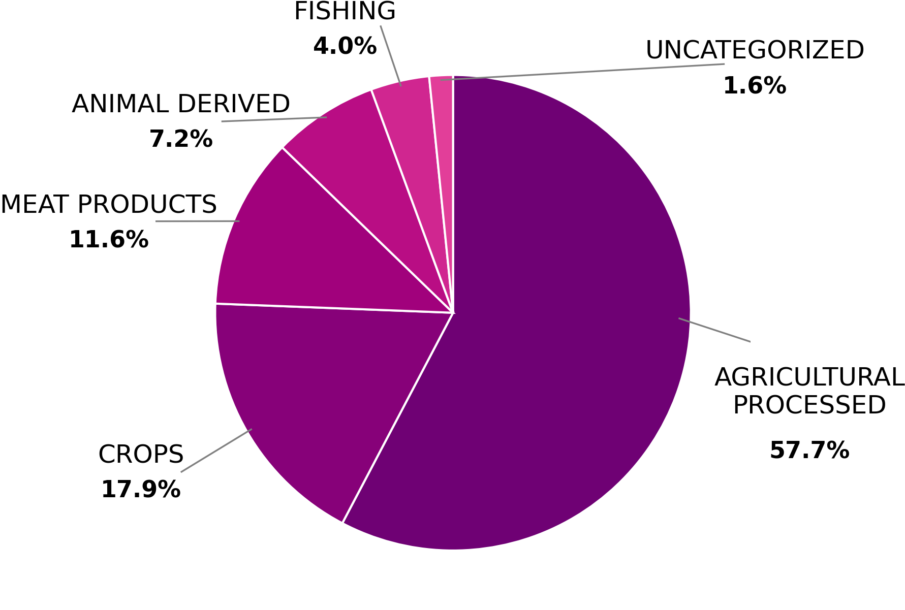
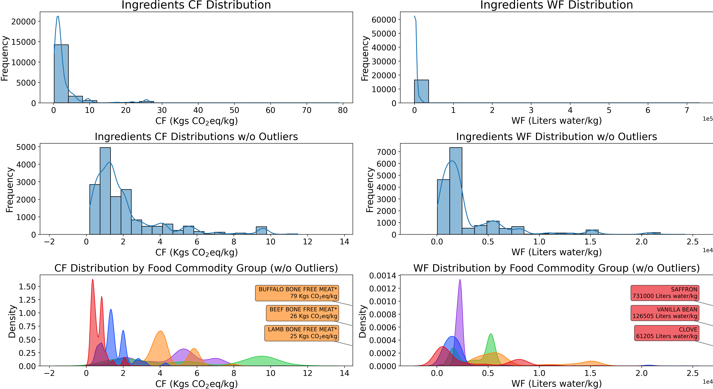
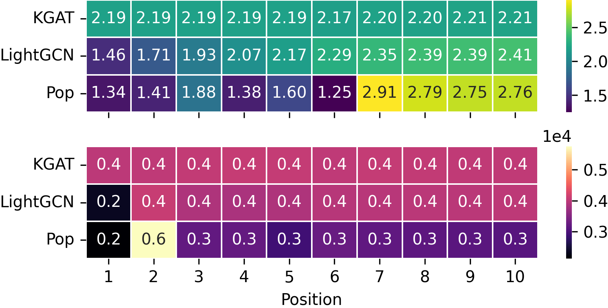
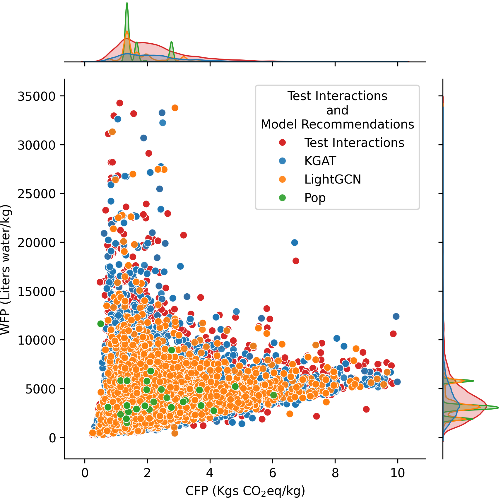

# GreenFoodLens: Sustainability-Aware Food Recommendation with LLM-Based Ingredient Labeling

This repository contains the code and resources to reproduce the sustainability-aware food recommendation system presented in our research. The system combines large language models (LLMs) for ingredient labeling with knowledge graph-enhanced recommendation algorithms to provide environmentally conscious food recommendations.

## 📊 Dataset

The complete dataset and pre-processed files are available on Zenodo:

[](https://doi.org/10.5281/zenodo.15398477)

The Zenodo release includes:
- **`pp_recipes_with_cf_wf.csv`**: HUMMUS dataset augmented with Carbon Footprint (CF) and Water Footprint (WF) values aggregated at the recipe level
- **Labeled ingredients dataset**: Ground truth and LLM-generated labels for ingredient taxonomy classification
- **Pre-trained recommendation models**: RecBole-compatible model files for immediate evaluation
- **Evaluation metrics**: Comprehensive sustainability and recommendation performance metrics

To streamline your workflow, we recommend downloading the pre-processed data from Zenodo to avoid lengthy preprocessing steps.

## 📥 Required External Files

Some files referenced in the pipeline are not included in this repository and need to be downloaded separately:

### From Zenodo Dataset
- `greenfoodlens_mturk_labels.csv`: Ground truth ingredient labels
- `labeled_ingredients_*.csv`: Pre-generated LLM labels for various models
- `recipes_with_cf_wf.csv`: Final processed recipes with sustainability metrics

### From HUMMUS Repository
- `pp_recipes.csv`: Original HUMMUS recipe dataset
- Download from: [HUMMUS GitLab Repository](https://gitlab.com/felix134/connected-recipe-data-set)

### From SU-EATABLE-LIFE Database
- `SuEatableLife_Food_Fooprint_database_CF.csv`: Tab-separated export of "CF for users" sheet
- `SuEatableLife_Food_Fooprint_database_WF.csv`: Tab-separated export of "WF for users" sheet
- Source: [SU-EATABLE-LIFE](https://doi.org/10.6084/m9.figshare.13271111)

### GGUF Model Files
- Llama 3.1 Nemotron 70B Q4_K_M GGUF model: Q4_K_M quantizied version provided by bartowski, available at https://huggingface.co/bartowski/Llama-3.1-Nemotron-70B-Instruct-HF-GGUF
- Athene V2 Chat Q4_K_M GGUF model: Q4_K_M quantizied version provided by bartowski, available at https://huggingface.co/bartowski/Athene-V2-Chat-GGUF

## 🛠️ Installation

### Prerequisites
- Python 3.8 or higher
- [uv](https://docs.astral.sh/uv/) package manager (recommended) or pip
- **For LLM Inference**: GPU with at least 40GB VRAM recommended

### Quick Installation with uv

1. Install uv if you haven't already:
```bash
curl -LsSf https://astral.sh/uv/install.sh | sh
```

2. Clone the repository:
```bash
git clone https://github.com/yourusername/PHASEIngredientLabeling.git
cd PHASEIngredientLabeling
```

3. Create a virtual environment and install dependencies:
```bash
uv venv
source .venv/bin/activate  # On Windows: .venv\Scripts\activate
uv sync
```

## 🔧 Troubleshooting

### Common Issues

**LLM Inference Issues:**
- **Out of memory errors**: Reduce `--context_len` or use a smaller model
- **Slow inference**: Ensure GPU support is properly configured for llama-cpp-python

**Missing Files:**
- Check that all required external files are downloaded and placed in the correct directories
- Verify file paths in configuration files match your actual file locations

### Performance Tips
- Use `--eval_batch_size` parameter to balance memory usage and speed
- Consider using more quantized models (Q4_K_S) for faster inference with minimal quality loss

## 🚀 Usage Pipeline

Follow these steps to reproduce the complete pipeline from ingredient labeling to sustainability-aware recommendation:

### Step 1: LLM-Based Ingredient Labeling

Generate taxonomy labels for ingredients using constrained LLM generation:

```bash
python src/llama_cpp_grammar_ingredient_labeling.py \
    /path/to/your/model.gguf \
    v1 \
    --truth_labels_file greenfoodlens_mturk_labels.csv \
    --context_len 12000 \
    --temperature 0.0 \
    --validation_split 0.5
```

**Arguments:**
- `gguf_path`: Path to the LLM GGUF model file
- `version_tag`: Version identifier (format: vX, where X is an integer)
- `--truth_labels_file`: Path to ground truth labels file (default: greenfoodlens_mturk_labels.csv)
- `--context_len`: Model context length (default: 0 for auto)
- `--temperature`: Sampling temperature (default: 0.0 for deterministic output)
- `--top-p`: Top-p sampling parameter (default: 1.0)
- `--top-k`: Top-k sampling parameter (default: 1.0)
- `--split_grammar_chars`: Split grammar choices into individual characters (default: False)
- `--use_all_ingredients`: Label all ingredients instead of just validation/test splits
- `--validation_split`: Fraction for validation split (default: 0.5)
- `--gpu_id`: GPU ID to use for inference

This script uses the `revised_su-eatable-life_taxonomy.json` to generate constrained grammars that ensure LLM outputs conform to valid taxonomy paths.

### Step 2: Label Evaluation

Evaluate the quality of generated labels against ground truth:

```bash
python src/evaluate_llm_labeling.py \
    labeled_ingredients_model1.csv labeled_ingredients_model2.csv \
    --truth_labels_file greenfoodlens_mturk_labels.csv
```

**Arguments:**
- `llm_labeled_ingredients_files`: One or more paths to LLM-generated label files (e.g., labeled_ingredients_Athene-V2-Chat-Q4_K_M.csv)
- `--truth_labels_file`: Path to ground truth labels (default: greenfoodlens_mturk_labels.csv)

This script computes accuracy metrics including:
- Perfect matches
- Hierarchical matches with different levels of granularity
- Head-level and tail-cut matching strategies

### Step 3: Labeling Analysis

Open and run the Jupyter notebook for comprehensive analysis, replicate paper figures, and generate final files (e.g., recipes_with_cf_wf.csv):

```bash
jupyter notebook src/labeling_analysis.ipynb
```

This notebook relies on several files:
- ground truth labels (`greenfoodlens_mturk_labels.csv`)
- LLM-generated labels (e.g., `labeled_ingredients_Athene-V2-Chat-Q4_K_M.csv`)
- HUMMUS recipes `pp_recipes.csv`, which can be downloaded from HUMMUS repository
- other files deriving from light transformations of our revised taxonomy and the SU-EATABLE-LIFE excel database:
    - `CSV_cfp_wfp_ingredients_2.0.csv` (included in this repo): CF and WF values for each food item (last level) of the revised taxonomy
    - `SuEatableLife_Food_Fooprint_database_CF.csv`: it's the tab-separated export of the "CF for users" sheet of the SU-EATABLE-LIFE excel database
    - `SuEatableLife_Food_Fooprint_database_WF.csv`: it's the tab-separated export of the "WF for users" sheet of the SU-EATABLE-LIFE excel database

### Step 4: Train Recommendation Models (Prerequisites)

Before running sustainability analysis, train recommendation models using RecBole:

1. Ensure you have the HUMMUS dataset with the configuration in `experiment_config.yaml`
2. Train models using RecBole framework:

```bash
# Example training command (adjust based on your RecBole setup)
python run_recbole --model=KGAT --dataset=hummus --config_files=experiment_config.yaml
python run_recbole --model=MultiVAE --dataset=hummus --config_files=experiment_config.yaml
```

### Step 5: Sustainability Analysis

Analyze the sustainability performance of trained recommendation models:

```bash
python test_model_sustainability.py \
    /path/to/model1.pth /path/to/model2.pth \
    --recipes_with_cf_wf recipes_with_cf_wf.csv \
    --plots_path plots \
    --eval_batch_size 50000 \
    --CF_WF_per_serving_size
```

**Arguments:**
- `model_files`: Paths to pre-trained RecBole model files (.pth)
- `--recipes_with_cf_wf`: Path to recipes with CF/WF data (default: recipes_with_cf_wf.csv)
- `--plots_path`: Directory for saving plots (default: plots)
- `--gpu_id`: GPU ID for evaluation (default: "0")
- `--eval_batch_size`: Batch size for evaluation (default: 50,000)
- `--skip_eval`: Skip model evaluation if results exist
- `--CF_WF_per_serving_size`: Calculate CF/WF per serving size instead of per kg (default: False)

This script generates:
- Sustainability heatmaps showing CF/WF across recommendation positions
- Joint plots comparing different models' sustainability profiles

## 📊 Additional Analysis Scripts

### Semantic Matching Analysis

Reproduce the semantic matching baseline analysis (referenced in paper):

```bash
python src/semantic_matching_eda.py
```

This script demonstrates the limitations of semantic similarity approaches for ingredient taxonomy matching, showing why structured LLM-based labeling is superior. Requires `revised_food_taxonomy.json` and `ingredient_food_kg_names.csv` for unique food KG ingredient names.

## 📋 Configuration Files

- **`experiment_config.yaml`**: RecBole configuration for training and evaluating recommendation models. Includes custom metrics (Novelty) that extend the standard RecBole framework.
- **`revised_su-eatable-life_taxonomy.json`**: Hierarchical food taxonomy used for ingredient labeling, revised and validated for the sustainability domain.
- **`revised_su_eatable_life.pdf`**: Human-readable visualization of the taxonomy hierarchy.

## 📁 Repository Structure

```
PHASEIngredientLabeling/
├── src/
│   ├── llama_cpp_grammar_ingredient_labeling.py  # LLM labeling script
│   ├── evaluate_llm_labeling.py                  # Label evaluation
│   ├── labeling_analysis.ipynb                   # Analysis notebook
│   ├── semantic_matching_eda.py                  # Semantic baseline
│   ├── prompt_templates_guidance.py              # LLM prompts
│   └── utils.py                                  # Utility functions
├── test_model_sustainability.py                  # Sustainability analysis
├── experiment_config.yaml                        # RecBole configuration
├── revised_su-eatable-life_taxonomy.json         # Food taxonomy
├── revised_su_eatable_life.pdf                   # Taxonomy visualization
├── ingredient_food_kg_names.csv                  # Unique Food KG ingredients
├── CSV_cfp_wfp_ingredients_2.0.csv               # CF and WF for each taxonomy food item
└── pyproject.toml                                # Project dependencies
```

## 🔗 Dependencies

Core dependencies include:
- **polars**: Fast DataFrame operations
- **llama-cpp-python**: LLM inference with grammar constraints
- **sentence-transformers**: Semantic similarity baseline
- **recbole**: Recommendation system framework
- **torch**: Deep learning backend
- **matplotlib/seaborn**: Visualization

To installa llama-cpp-python with GPU support, please follow the instructions in the [llama-cpp-python documentation](https://llama-cpp-python.readthedocs.io/en/latest/).

See `pyproject.toml` for complete dependency list.

<!-- ## 📄 Citation

If you use this code or dataset in your research, please cite our paper:

```bibtex
@article{your_paper_2024,
  title={GreenFoodLens: Sustainability-Aware Food Recommendation with LLM-Based Ingredient Labeling},
  author={Your Authors},
  journal={Your Journal},
  year={2024}
}
```
-->

## 📈 Results

### Distribution of HUMMUS ingredients based on sustainability food groups (1st taxonomy level)



### Distribution of ingredients CF and WF values across HUMMUS recipes




### Average CF (on top) and WF (on bottom) values for each top-10 recommendation position



### CF and WF scatterplot of test interactions (from the test set) and top-10 recommendations (density marginal distributions on the sides)



## 📜 License

This project is licensed under the MIT License - see the LICENSE file for details.
